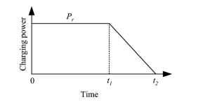

# EV-Sim
Simulation of an EV charging scenario in a Python-based environment

For the environment setup, install the dependencies on requirements.txt.
 
```
pip install -r requirements.txt
```


# EV battery charging load curve

The battery charging load curve used in this project was derived from the methodology proposed by Zhang et al. (2012), considering a constant power at first, and then a piecewise linear profile:



For the simulation, some adaptations were made to account for the discrete-time operation of the model. In particular, the linear decreasing profile was adjusted starting at 30 minutes before disconnection, or if the next two charging steps at constant power would exceed the battery capacity, to prevent overcharging.

Additionally, the battery capacity values were sourced from the European Alternative Fuels Observatory, based on last year's data.


# References 


P. Zhang, K. Qian, C. Zhou, B. G. Stewart and D. M. Hepburn, "A Methodology for Optimization of Power Systems Demand Due to Electric Vehicle Charging Load," in IEEE Transactions on Power Systems, vol. 27, no. 3, pp. 1628-1636, Aug. 2012, doi: 10.1109/TPWRS.2012.2186595. keywords: {Batteries;System-on-a-chip;Optimization;Power demand;Vehicles;Companies;Electric vehicle (EV);load modeling;power demand;quadratic programming}

European Alternative Fuels Observatory, "Electric Vehicle Model Statistics," [Online]. Available: https://alternative-fuels-observatory.ec.europa.eu/policymakers-and-public-authorities/electric-vehicle-model-statistics. 
